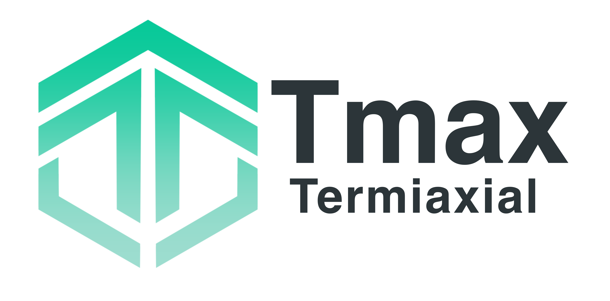
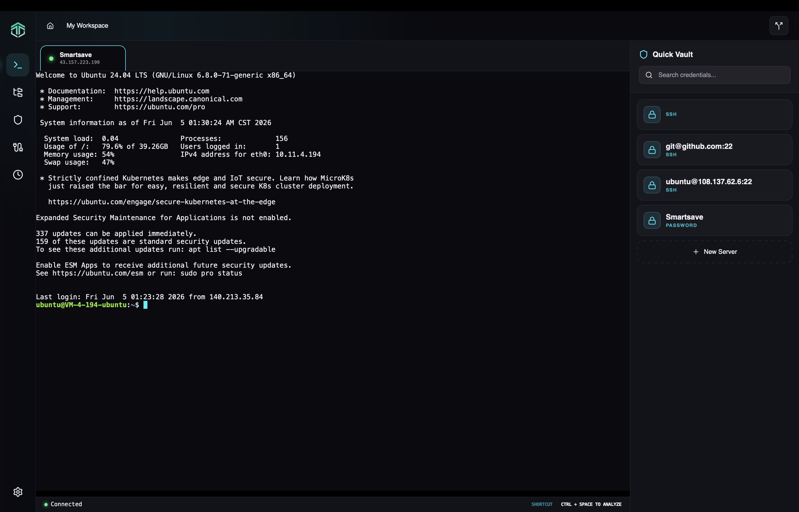
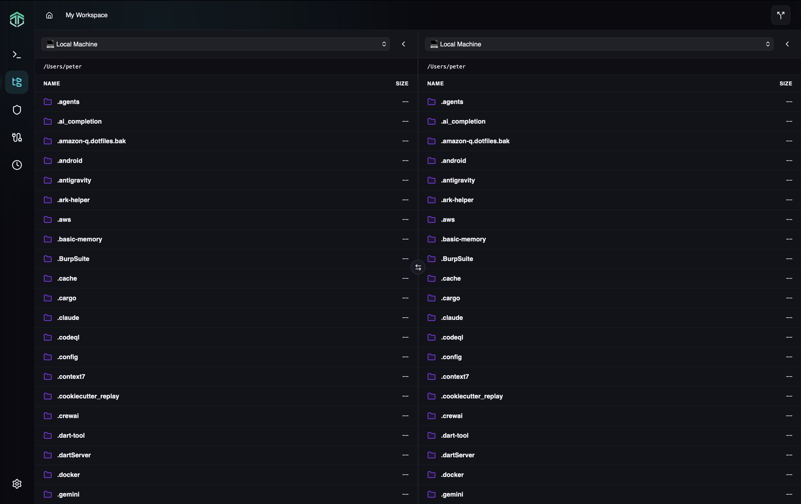
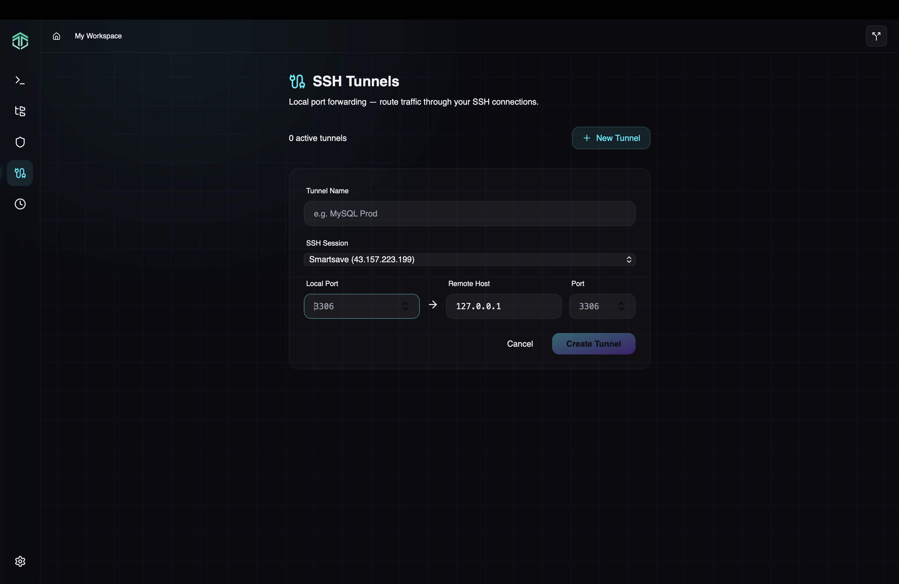
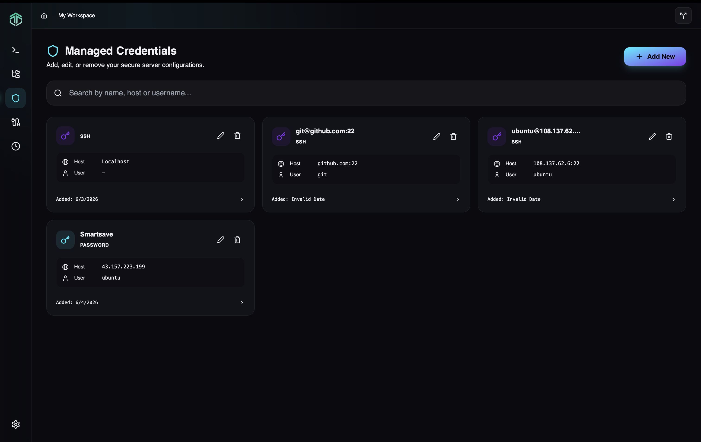
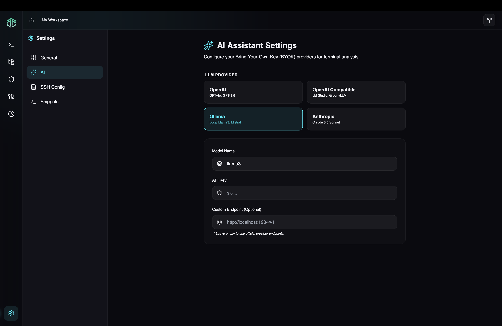

<p align="center">
  
</p>

<p align="center">
  <strong>Ultra-lightweight SSH/SFTP client for Desktop & Android — built with Rust + Tauri v2</strong>
</p>

<p align="center">
  <a href="https://github.com/angga30/termiaxial/actions"></a>
  <a href="https://opensource.org/licenses/MIT"></a>
</p>

---

## 🎯 What is Termiaxial?

Termiaxial is a **zero-bloat SSH client** that replaces Termius, PuTTY, and WinSCP with a single, fast, and secure application. Runs on **1/10th the RAM** of Electron-based alternatives.

### Why Tmax?
- **50MB idle RAM** vs 200MB+ for Termius
- **<1.5s startup** — instant access to your servers
- **Native performance** — Rust backend, React frontend
- **Zero-knowledge sync** — multi-device vault sync, server can't read your credentials
- **AI-powered** — terminal analysis, command autocomplete

---

## ✨ Features

### Core
- ✅ SSH authentication (password + private key: RSA, ED25519)
- ✅ Full terminal emulator (Xterm.js, 256 colors, 5000-line scrollback)
- ✅ SFTP file explorer with drag-drop upload/download
- ✅ Multi-tab sessions with auto-reconnect

### Security
- ✅ Master Password with Argon2id hashing
- ✅ AES-GCM-256 encrypted credential vault
- ✅ Local SQLite storage (no cloud by default)

### AI & Productivity
- ✅ AI Assistant (OpenAI, Ollama, Anthropic)
- ✅ Terminal analysis with Ctrl+Space shortcut

---

## 📸 Screenshots

<p align="center">
  
</p>

<details>
<summary><strong>More screenshots</strong></summary>

| SFTP Explorer | SSH Tunnels |
|:---:|:---:|
|  |  |

| Credential Vault | AI Assistant |
|:---:|:---:|
|  |  |

</details>

---

## 🚀 Roadmap

See [MVP2 Roadmap](docs/MVP2_ROADMAP.md) for upcoming features:
- SSH Tunneling (Local/Remote/SOCKS5)
- Snippet Manager with fuzzy search
- Session Recording (Asciinema format)
- AI Autocomplete
- Cloud Sync

---

## 📦 Installation

### From Source
```bash
git clone git@github.com:angga30/termiaxial.git
cd termiaxial
npm install
npm run tauri dev
```

### Build
```bash
npm run tauri build
```

---

## 🛠️ Tech Stack

| Layer | Technology |
|-------|-----------|
| Framework | Tauri v2 |
| Frontend | React 19 + TypeScript + Tailwind CSS |
| Backend | Rust (russh, tokio) |
| Terminal | Xterm.js v6 |
| Crypto | ring (AES-GCM-256) + argon2 |
| Database | SQLite (WAL mode) |

---

## 🤝 Contributing

We welcome contributions! See [CONTRIBUTING.md](CONTRIBUTING.md) for guidelines.

---

## 📄 License

MIT License — See [LICENSE](LICENSE) for details

---

## 🔗 Links

- **Docs**: [/docs](docs/)
- **Issues**: [GitHub Issues](https://github.com/angga30/termiaxial/issues)
- **Discussions**: [GitHub Discussions](https://github.com/angga30/termiaxial/discussions)

---

**Made with ❤️ by developers, for developers.**
